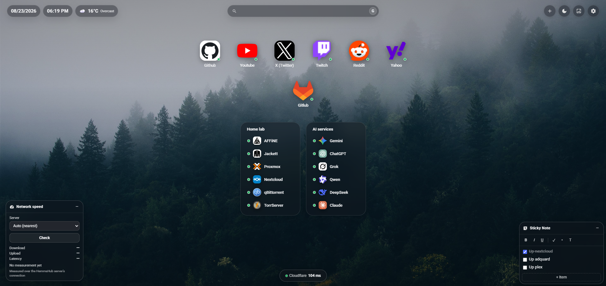
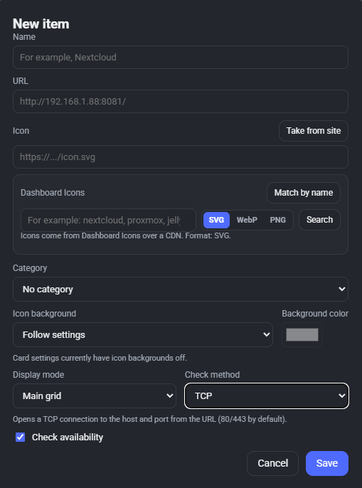

# Hemma

**Hemma** is a self-hosted personal home dashboard for managing local services, bookmarks, and service availability from a single browser page.

It is designed primarily for trusted local networks and can be deployed with Docker.

**Documentation:** [English](README.md) · [Русский](README.ru.md)

## Screenshots

### Dashboard



### New element



## Features

- Local services and bookmarks in a customizable dashboard
- CRUD management for services, bookmarks, and categories
- Favorites and drag-and-drop card sorting
- Local search with selectable external search engines
- Light and dark themes
- Custom wallpapers and uploaded backgrounds
- Date, time, and weather widgets
- Weather via Open-Meteo — no API key required
- HTTP/HTTPS, TCP, and ICMP health checks
- Availability history with uptime, latency, and incidents
- Configurable check interval and timeout
- Manual service re-check
- Favicon and service icon support
- JSON configuration import/export
- SQLite persistence
- Responsive desktop, tablet, and mobile layout
- Docker deployment

## Requirements

### Docker

- Docker
- Docker Compose

### Development without Docker

- Node.js 20+

## Quick Start

### From source

Clone the repository:

```bash
git clone https://github.com/Judiooo/hemma.git
cd hemma
```

Start Hemma:

```bash
docker compose up -d --build
```

Open:

```text
http://<SERVER_IP>:8000/
```

For example:

```text
http://192.168.1.11:8000/
```

View logs:

```bash
docker compose logs -f
```

Stop Hemma:

```bash
docker compose down
```

### Using the Docker image

Hemma can also be run without cloning the source repository using the pre-built image from GitHub Container Registry:

```text
ghcr.io/judiooo/hemma:latest
```

Create a `docker-compose.yml` file:

```yaml
services:
  hemma:
    image: ghcr.io/judiooo/hemma:latest
    container_name: hemma
    restart: unless-stopped
    ports:
      - "8000:3000"
    volumes:
      - hemma-data:/app/data
    environment:
      PORT: 3000
      DB_PATH: /app/data/app.db

volumes:
  hemma-data:
```

Start Hemma:

```bash
docker compose up -d
```

This method does not require downloading or cloning the Hemma source code.

## Data Persistence

Hemma uses SQLite for persistent application data.

The database is stored inside the container at:

```text
/app/data/app.db
```

For a source-based Docker Compose deployment, the default host directory is:

```text
./data
```

User-uploaded background images are also stored in the data directory.

For Docker deployments using the published image, the recommended persistent storage is the `hemma-data` Docker volume.

## Configuration

The application listens on port `3000` inside the container.

The default Docker Compose configuration exposes it on port `8000`:

```yaml
ports:
  - "8000:3000"
```

To use another host port, change the left side:

```yaml
ports:
  - "8080:3000"
```

Environment variables:

```yaml
environment:
  PORT: 3000
  DB_PATH: /app/data/app.db
```

## Health Monitoring

Hemma supports three health-check methods:

| Method | What it checks |
|---|---|
| HTTP/HTTPS | Sends an HTTP request and measures response time |
| TCP | Measures the time required to establish a TCP connection |
| ICMP | Sends an ICMP echo request |

HTTP latency represents the time required to receive the HTTP response. It is not the same as ICMP ping latency.

For local services, TCP monitoring can be useful when the goal is to verify that a port is reachable and accepting connections.

## Development Without Docker

Install dependencies:

```bash
cd app
npm install
```

Start the server:

```bash
DB_PATH=./data/app.db PORT=3000 node server.js
```

Open:

```text
http://localhost:3000/
```

On Windows PowerShell:

```powershell
$env:DB_PATH="./data/app.db"
$env:PORT="3000"
node server.js
```

## Third-Party Assets

Hemma may use service icons from third-party icon collections, including [Dashboard Icons](https://github.com/homarr-labs/dashboard-icons).

Dashboard Icons is distributed under the **Apache License 2.0**. Its license and attribution requirements apply to the third-party assets and do not change the license of Hemma.

When redistributing third-party assets covered by Apache License 2.0, the applicable license, copyright notices, attribution notices, and required `NOTICE` information must be retained.

Brand names, logos, product names, trademarks, and registered trademarks belong to their respective owners. Icons are used for identification purposes only and do not imply endorsement, sponsorship, affiliation, or approval by the respective trademark owners.

Third-party licenses do not grant trademark rights to the brands represented by those assets.

## Security

Hemma does not currently provide built-in user authentication.

It is intended primarily for use inside a trusted local network.

If Hemma needs to be exposed beyond a trusted LAN, place it behind an authentication-capable reverse proxy or VPN.

Do not expose Hemma directly to the public Internet without considering authentication and access control.

## Backup

Hemma provides JSON configuration export/import.

For a complete backup, preserve the persistent `data` directory or Docker volume because it contains the SQLite database and user-uploaded background files.

## License

Hemma is distributed under the **MIT License**.

See the [LICENSE](LICENSE) file for the complete license text.

Third-party assets remain subject to their respective licenses.
